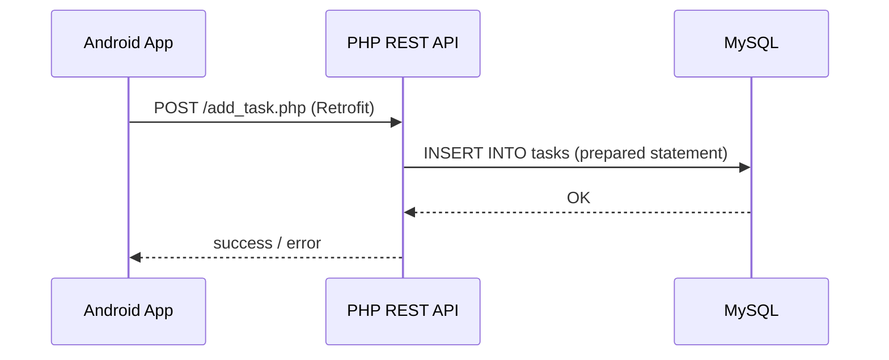

# 📝 ToDoList: Android App + PHP REST API


A task management application made of a **native Android client (Java)** and a **PHP / MySQL REST API**. The mobile app consumes an HTTP API that persists data in a MySQL database, illustrating a simple client-server architecture.


## 📌 Table of Contents

- [Overview](#-overview)
- [Screenshots](#-screenshots)
- [Architecture](#-architecture)
- [Tech Stack](#-tech-stack)
- [Security](#-security)
- [Project Structure](#-project-structure)
- [Database](#-database)
- [API Endpoints](#-api-endpoints)
- [Installation](#-installation)
- [Roadmap](#-roadmap)
- [License](#-license)
- [Author](#-author)

## 🚀 Overview

ToDoList allows a user to:

- Create an account and log in (register / login)
- Add, edit and delete tasks with an associated date
- Mark a task as completed
- View, in a dedicated tab, the tasks scheduled for today

The app follows the standard Android **Activity → Fragments (Bottom Navigation)** architecture, with **Retrofit** handling network communication with the PHP API.

## 📸 Screenshots

| Registration | Login | Home |
|---|---|---|
|  |  |  |

| Add task | Task list | Today's tasks |
|---|---|---|
|  |  |  |

## 🏗 Architecture



## 🛠 Tech Stack

**Mobile**

- Java, Android SDK (minSdk 24, targetSdk 35)
- Fragments + Bottom Navigation
- Retrofit 2 + Gson
- OkHttp Logging Interceptor
- ViewBinding

**Backend**

- PHP (procedural, mysqli)
- MySQL / MariaDB (via XAMPP)
- Simple REST API (plain-text and JSON responses)

## 🔒 Security

| Measure | Details |
|---|---|
| Password storage | Hashed with `password_hash()` (bcrypt), verified with `password_verify()` |
| SQL injection | Prepared statements (`mysqli`) on the authentication endpoints (`register.php`, `login.php`) |
| Input validation | Empty fields, email format and minimum password length (8) checked on registration |
| Duplicate accounts | `UNIQUE` constraint on `users.email` |

> The remaining task endpoints are being migrated to prepared statements, see the [Roadmap](#-roadmap).

## 📂 Project Structure

```
ToDoList-FullStack/
├── backend/                  # PHP REST API (todolistapi)
│   ├── db.php                # MySQL connection
│   ├── register.php          # User registration
│   ├── login.php             # User login
│   ├── add_task.php          # Add a task
│   ├── get_tasks.php         # Retrieve tasks (JSON)
│   ├── update_task.php       # Edit a task
│   ├── delete_task.php       # Delete a task
│   └── toggle_task.php       # Toggle the "completed" state
│
├── mobile/                   # Android application (ToDoListProjet)
│   └── app/src/main/java/my/app/todolistprojet/
│       ├── LoginActivity.java
│       ├── RegisterActivity.java
│       ├── MainActivity.java
│       ├── ApiService.java        # Retrofit interface
│       ├── RetrofitClient.java    # Retrofit config (base URL)
│       ├── Task.java              # Data model
│       ├── TaskAdapter.java       # ListView adapter
│       └── ui/
│           ├── dashboard/         # Add / list tasks
│           ├── home/
│           └── notifications/     # Today's tasks
│
├── database/
│   └── todolist.sql          # Database creation script
│
├── screenshots/              # Images used in this README
└── README.md
```

## 🗄 Database

Two main tables (see `database/todolist.sql`):

**users**

| Column | Type | Details |
|---|---|---|
| id | INT | PK, AUTO_INCREMENT |
| username | VARCHAR(255) | |
| email | VARCHAR(255) | UNIQUE |
| password | VARCHAR(255) | bcrypt hash |

**tasks**

| Column | Type | Details |
|---|---|---|
| id | INT | PK, AUTO_INCREMENT |
| title | VARCHAR(255) | |
| date_task | DATE | `yyyy-MM-dd` format |
| completed | TINYINT(1) | default 0 |

## 🔌 API Endpoints

| Method | Endpoint | Parameters | Response | Description |
|---|---|---|---|---|
| POST | `/register.php` | username, email, password | `success` / `error` | Create an account |
| POST | `/login.php` | email, password | `success` / `error` | Authenticate a user |
| GET | `/get_tasks.php` | none | JSON | List tasks |
| POST | `/add_task.php` | title, date | text | Add a task |
| POST | `/update_task.php` | id, title, date | text | Edit a task |
| POST | `/delete_task.php` | id | text | Delete a task |
| POST | `/toggle_task.php` | id, completed | text | Mark as completed / not completed |

Quick test with curl:

```bash
curl -X POST http://localhost/todolistapi/register.php \
  -d "username=test&email=test@mail.com&password=Secret123"

curl -X POST http://localhost/todolistapi/login.php \
  -d "email=test@mail.com&password=Secret123"
```

## ⚙️ Installation

### 1. Backend (PHP API)

```bash
# Copy the backend/ folder into XAMPP's htdocs
cp -r backend/ C:/xampp/htdocs/todolistapi

# Start Apache and MySQL from the XAMPP control panel

# Import the database
# phpMyAdmin > Create a "todolist" database > Import > database/todolist.sql
```

The API is then available at `http://localhost/todolistapi/`.

### 2. Mobile application (Android)

Open the `mobile/` folder in Android Studio and check the base URL in `RetrofitClient.java`:

```java
private static final String BASE_URL = "http://10.0.2.2/todolistapi/";
```

- `10.0.2.2` is your machine's `localhost` as seen from the Android emulator.
- On a physical phone, use your PC's local IP address (e.g. `http://192.168.1.X/todolistapi/`).
- This project uses plain HTTP for local development only. A production deployment requires HTTPS.

Run the app from Android Studio (Run ▶️).

## 🧭 Roadmap

- [x] Hash passwords (`password_hash` / `password_verify`)
- [x] Prepared statements on `register.php` and `login.php`
- [ ] Prepared statements on the task endpoints (`add`, `get`, `update`, `delete`, `toggle`)
- [ ] Link tasks to the logged-in user (`user_id` foreign key)
- [ ] Token-based authentication (JWT or session token)
- [ ] Local push notifications (reminders for today's tasks)
- [ ] Unit and instrumented tests for the Android app

## 📄 License

Released under the [MIT License](LICENSE).

## 👤 Author

**Ons Ajmi**: Engineering Student in Cloud Infrastructure Management @ TEK-UP University

[GitHub: AjmiOns](https://github.com/AjmiOns) · [LinkedIn: Ons Ajmi](https://www.linkedin.com/)

*Built while learning Android development and REST APIs.*
