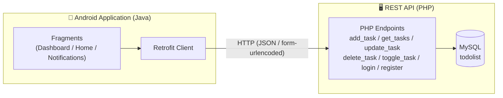
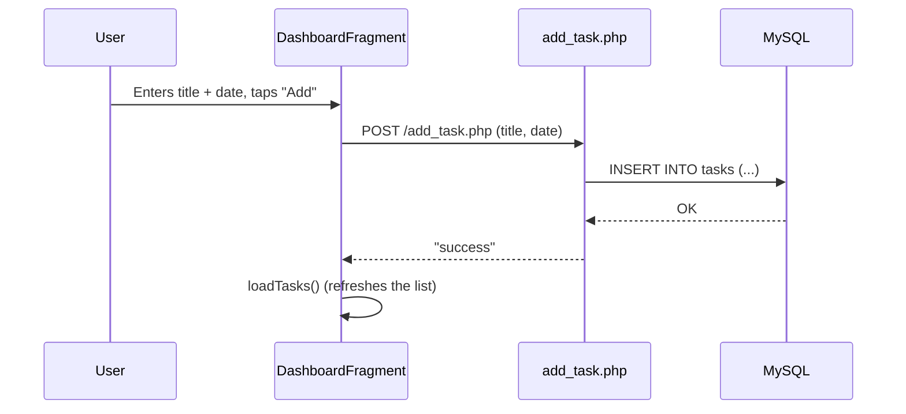

# 📝 ToDoList — Full Stack Application (Android + REST API)

A task management application made up of a **native Android client** (Java) and a **PHP / MySQL REST API**. The project illustrates a simple client-server architecture: the mobile app consumes an HTTP API that persists data in a MySQL database.


---

## 📌 Table of Contents

- [Overview](#-overview)
- [Screenshots](#-screenshots)
- [Architecture](#-architecture)
- [Tech Stack](#-tech-stack)
- [Project Structure](#-project-structure)
- [Database](#-database)
- [API Endpoints](#-api-endpoints)
- [Installation](#-installation)
- [Roadmap / Improvements](#-roadmap--improvements)
- [Author](#-author)

---

## 🚀 Overview

**ToDoList** allows a user to:
- Create an account and log in (`register` / `login`)
- Add, edit and delete tasks with an associated date
- Mark a task as completed
- View, in a dedicated tab, the tasks scheduled **for today** (notifications)

The app follows the standard Android **Activity → Fragments (Bottom Navigation)** architecture, with **Retrofit** handling network communication with the PHP API.

---

## 📸 Screenshots

<table align="center">
  <tr>
    <td align="center">
      <br/>
      <sub><b>Registration</b></sub>
    </td>
    <td align="center">
      <br/>
      <sub><b>Login</b></sub>
    </td>
    <td align="center">
      <br/>
      <sub><b>Home</b></sub>
    </td>
  </tr>
  <tr>
    <td align="center">
      <br/>
      <sub><b>Add task</b></sub>
    </td>
    <td align="center">
      <br/>
      <sub><b>Task list</b></sub>
    </td>
    <td align="center">
      <br/>
      <sub><b>Today's notifications</b></sub>
    </td>
  </tr>
</table>

---

## 🏗 Architecture



### Task creation flow



---

## 🛠 Tech Stack

**Mobile**
- Java, Android SDK (minSdk 24, targetSdk 35)
- Fragments + Bottom Navigation architecture
- [Retrofit 2](https://square.github.io/retrofit/) + Gson (API calls)
- OkHttp Logging Interceptor
- ViewBinding

**Backend**
- PHP (procedural, `mysqli`)
- MySQL / MariaDB (via XAMPP)
- Simple REST API (`JSON` / text `success` / `error` responses)

---

## 📂 Project Structure

```
ToDoList-FullStack/
├── backend/                  # PHP REST API (todolistapi)
│   ├── db.php                 # MySQL connection
│   ├── register.php           # User registration
│   ├── login.php              # User login
│   ├── add_task.php           # Add a task
│   ├── get_tasks.php          # Retrieve all tasks (JSON)
│   ├── update_task.php        # Edit a task
│   ├── delete_task.php        # Delete a task
│   └── toggle_task.php        # Toggle the "completed" state
│
├── mobile/                   # Android application (ToDoListProjet)
│   └── app/src/main/java/my/app/todolistprojet/
│       ├── LoginActivity.java
│       ├── RegisterActivity.java
│       ├── MainActivity.java
│       ├── ApiService.java        # Retrofit interface
│       ├── RetrofitClient.java    # Retrofit config (base URL)
│       ├── Task.java              # Data model
│       ├── TaskAdapter.java       # ListView adapter
│       └── ui/
│           ├── dashboard/         # Add / list tasks
│           ├── home/
│           └── notifications/     # Today's tasks
│
├── database/
│   └── todolist.sql          # Database creation script
│
├── screenshots/               # Screenshots for this README
└── README.md
```

---

## 🗄 Database

Two main tables (see [`database/todolist.sql`](database/todolist.sql)):

**`users`**

| Column | Type | Details |
|---|---|---|
| id | INT | PK, AUTO_INCREMENT |
| username | VARCHAR(255) | |
| email | VARCHAR(255) | UNIQUE |
| password | VARCHAR(255) | |

**`tasks`**

| Column | Type | Details |
|---|---|---|
| id | INT | PK, AUTO_INCREMENT |
| title | VARCHAR(255) | |
| date_task | DATE | `yyyy-MM-dd` format |
| completed | TINYINT(1) | default `0` |

---

## 🔌 API Endpoints

| Method | Endpoint | Parameters | Description |
|---|---|---|---|
| POST | `/register.php` | `username`, `email`, `password` | Create an account |
| POST | `/login.php` | `email`, `password` | Authenticate a user |
| GET | `/get_tasks.php` | — | List all tasks (JSON) |
| POST | `/add_task.php` | `title`, `date` | Add a task |
| POST | `/update_task.php` | `id`, `title`, `date` | Edit a task |
| POST | `/delete_task.php` | `id` | Delete a task |
| POST | `/toggle_task.php` | `id`, `completed` | Mark as completed / not completed |

---

## ⚙️ Installation

### 1. Backend (PHP API)

```bash
# Copy the backend/ folder into XAMPP's htdocs
cp -r backend/ C:/xampp/htdocs/todolistapi

# Start Apache and MySQL from the XAMPP control panel

# Import the database
# phpMyAdmin > Create a "todolist" database > Import > database/todolist.sql
```

The API is then available at `http://localhost/todolistapi/`.

### 2. Mobile application (Android)

```bash
# Open the mobile/ folder in Android Studio
```

Check the base URL in `RetrofitClient.java`:

```java
private static final String BASE_URL = "http://10.0.2.2/todolistapi/";
```

> `10.0.2.2` corresponds to your machine's `localhost`, as seen from the Android emulator. If you are testing on a physical phone, replace it with your PC's local IP address (e.g. `http://192.168.1.X/todolistapi/`).

Run the app from Android Studio (Run ▶️).

---

## 🧭 Roadmap / Improvements

- [ ] Secure SQL queries with prepared statements (protection against SQL injection)
- [ ] Hash passwords (`password_hash` / `password_verify`) instead of storing them in plain text
- [ ] Link tasks to the logged-in user (add a `user_id` column)
- [ ] Add a token/session system for authentication
- [ ] Local push notifications (reminders for today's tasks)
- [ ] Unit and instrumented tests for the Android app

---

## 👤 Author

Developed by **[Ons Ajmi]** — project carried out as part of learning Android mobile development and REST APIs.

<p align="center">
  <strong>Ons Ajmi</strong> — Engineering Student in Cloud Infrastructure Management @ TEK-UP University<br>
  GitHub : <a href="https://github.com/AjmiOns">AjmiOns</a> · 
  LinkedIn : <a href="https://www.linkedin.com/in/ons-ajmi-0ab2982a2/">Ons Ajmi</a>
</p>
