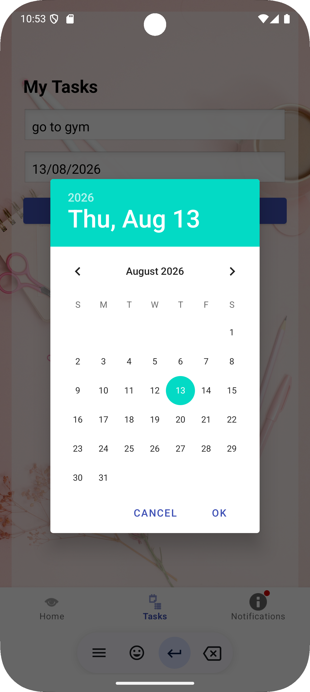
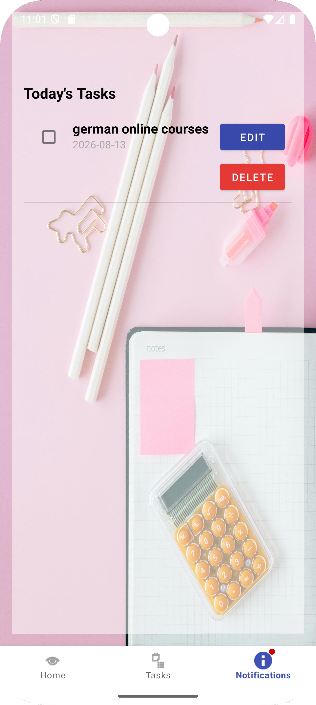
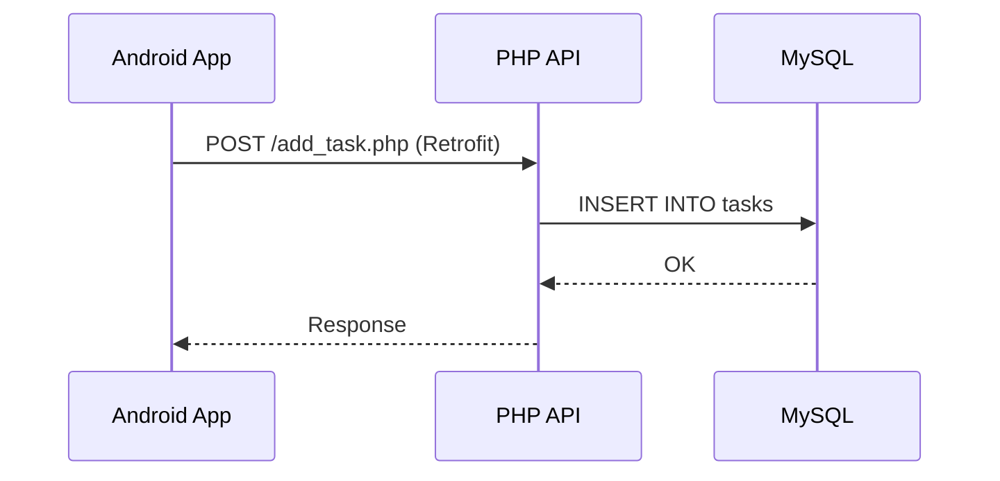

# 📝 ToDoList — Full Stack Application (Android + REST API)

A task management application made up of a native Android client (Java) and a PHP / MySQL REST API. The project illustrates a simple client-server architecture: the mobile app consumes an HTTP API that persists data in a MySQL database.

## 📌 Table of Contents

- [Overview](#-overview)
- [Screenshots](#-screenshots)
- [Architecture](#-architecture)
- [Tech Stack](#-tech-stack)
- [Project Structure](#-project-structure)
- [Database](#-database)
- [API Endpoints](#-api-endpoints)
- [Security](#-security)
- [Installation](#️-installation)
- [Roadmap / Improvements](#-roadmap--improvements)
- [Author](#-author)

## 🚀 Overview

ToDoList allows a user to:

- Create an account and log in (register / login)
- Add, edit and delete tasks with an associated date
- Mark a task as completed
- View, in a dedicated tab, the tasks scheduled for today (notifications)

The app follows the standard Android **Activity → Fragments (Bottom Navigation)** architecture, with **Retrofit** handling network communication with the PHP API.

## 📸 Screenshots

| Registration | Login | Home |
|---|---|---|
|  |  |  |

| Add task | Task list | Today's notifications |
|---|---|---|
|  |  |  |

## 🏗 Architecture

**Task creation flow**



## 🛠 Tech Stack

**Mobile**

- Java, Android SDK (minSdk 24, targetSdk 35)
- Fragments + Bottom Navigation architecture
- Retrofit 2 + Gson (API calls)
- OkHttp Logging Interceptor
- ViewBinding

**Backend**

- PHP (procedural, mysqli)
- MySQL / MariaDB (via XAMPP)
- Simple REST API (JSON / text success / error responses)

## 📂 Project Structure

```text
ToDoList-FullStack/
├── backend/                  # PHP REST API (todolistapi)
│   ├── db.php                 # MySQL connection
│   ├── register.php           # User registration (validation + hashed password)
│   ├── login.php              # User login (prepared statement + password_verify)
│   ├── add_task.php           # Add a task
│   ├── get_tasks.php          # Retrieve all tasks (JSON)
│   ├── update_task.php        # Edit a task
│   ├── delete_task.php        # Delete a task
│   └── toggle_task.php        # Toggle the "completed" state
│
├── mobile/                   # Android application (ToDoListProjet)
│   └── app/src/main/java/my/app/todolistprojet/
│       ├── LoginActivity.java
│       ├── RegisterActivity.java
│       ├── MainActivity.java
│       ├── ApiService.java        # Retrofit interface
│       ├── RetrofitClient.java    # Retrofit config (base URL)
│       ├── Task.java              # Data model
│       ├── TaskAdapter.java       # ListView adapter
│       └── ui/
│           ├── dashboard/         # Add / list tasks
│           ├── home/
│           └── notifications/     # Today's tasks
│
├── database/
│   └── todolist.sql          # Database creation script
│
├── screenshots/               # Screenshots for this README
└── README.md
```

## 🗄 Database

Two main tables (see `database/todolist.sql`):

**users**

| Column   | Type         | Details                           |
|----------|--------------|-----------------------------------|
| id       | INT          | PK, AUTO_INCREMENT                |
| username | VARCHAR(255) |                                   |
| email    | VARCHAR(255) | UNIQUE                            |
| password | VARCHAR(255) | bcrypt hash (`password_hash`)     |

**tasks**

| Column    | Type         | Details             |
|-----------|--------------|---------------------|
| id        | INT          | PK, AUTO_INCREMENT  |
| title     | VARCHAR(255) |                     |
| date_task | DATE         | yyyy-MM-dd format   |
| completed | TINYINT(1)   | default 0           |

## 🔌 API Endpoints

| Method | Endpoint         | Parameters                | Description                                                      |
|--------|------------------|---------------------------|------------------------------------------------------------------|
| POST   | /register.php    | username, email, password | Create an account (validated input, password hashed with bcrypt) |
| POST   | /login.php       | email, password           | Authenticate a user (returns `success` or `error`)               |
| GET    | /get_tasks.php   | —                         | List all tasks (JSON)                                            |
| POST   | /add_task.php    | title, date               | Add a task                                                       |
| POST   | /update_task.php | id, title, date           | Edit a task                                                      |
| POST   | /delete_task.php | id                        | Delete a task                                                    |
| POST   | /toggle_task.php | id, completed             | Mark as completed / not completed                                |

## 🔒 Security

The authentication endpoints (`register.php` and `login.php`) have been hardened:

| Measure | Details |
|---|---|
| **Password hashing** | Passwords are hashed with `password_hash()` (bcrypt) and verified with `password_verify()`; they are no longer stored in plain text |
| **SQL injection** | `register.php` and `login.php` use prepared statements (`mysqli` + `bind_param`) instead of concatenating user input into SQL |
| **Input validation** | Empty fields, email format (`FILTER_VALIDATE_EMAIL`) and a minimum password length of 8 characters are checked on registration |
| **Safe login check** | The password hash is fetched by email, then verified in PHP rather than compared inside the SQL query |
| **Duplicate accounts** | The `UNIQUE` constraint on `email` is enforced and handled without exposing database errors |

> ⚠️ **Upgrade note:** accounts created before this update have plain-text passwords and can no longer log in. Clear the `users` table (`TRUNCATE TABLE users;`) and register again.

**Still to be secured:** the task endpoints (`add_task.php`, `get_tasks.php`, `update_task.php`, `delete_task.php`, `toggle_task.php`) do not yet use prepared statements, and tasks are not yet linked to a user. See the Roadmap below.

## ⚙️ Installation

### 1. Backend (PHP API)

```bash
# Copy the backend/ folder into XAMPP's htdocs
cp -r backend/ C:/xampp/htdocs/todolistapi

# Start Apache and MySQL from the XAMPP control panel

# Import the database
# phpMyAdmin > Create a "todolist" database > Import > database/todolist.sql
```

The API is then available at `http://localhost/todolistapi/`.

### 2. Mobile application (Android)

```bash
# Open the mobile/ folder in Android Studio
```

Check the base URL in `RetrofitClient.java`:

```java
private static final String BASE_URL = "http://10.0.2.2/todolistapi/";
```

`10.0.2.2` corresponds to your machine's `localhost`, as seen from the Android emulator. If you are testing on a physical phone, replace it with your PC's local IP address (e.g. `http://192.168.1.X/todolistapi/`).

Run the app from Android Studio (Run ▶️).

## 🧭 Roadmap / Improvements

- [x] Hash passwords (`password_hash` / `password_verify`) instead of storing them in plain text
- [x] Secure SQL queries with prepared statements on `register.php` and `login.php` (protection against SQL injection)
- [x] Input validation on registration
- [ ] Secure SQL queries with prepared statements on the task endpoints
- [ ] Link tasks to the logged-in user (add a `user_id` column)
- [ ] Add a token/session system for authentication
- [ ] Local push notifications (reminders for today's tasks)
- [ ] Unit and instrumented tests for the Android app

## 👤 Author

Developed by **[Ons Ajmi]** — project carried out as part of learning Android mobile development and REST APIs.

Ons Ajmi — Engineering Student in Cloud Infrastructure Management @ TEK-UP University
GitHub : [AjmiOns](https://github.com/AjmiOns) · LinkedIn : Ons Ajmi
