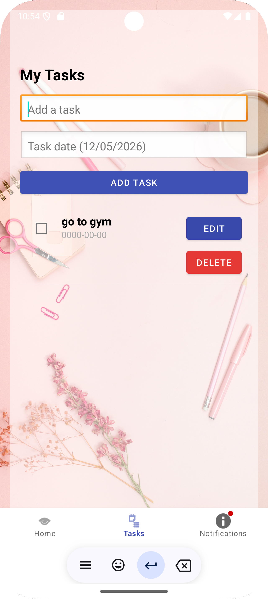
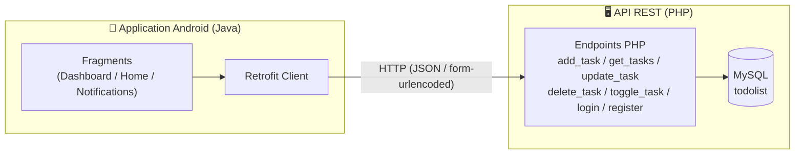
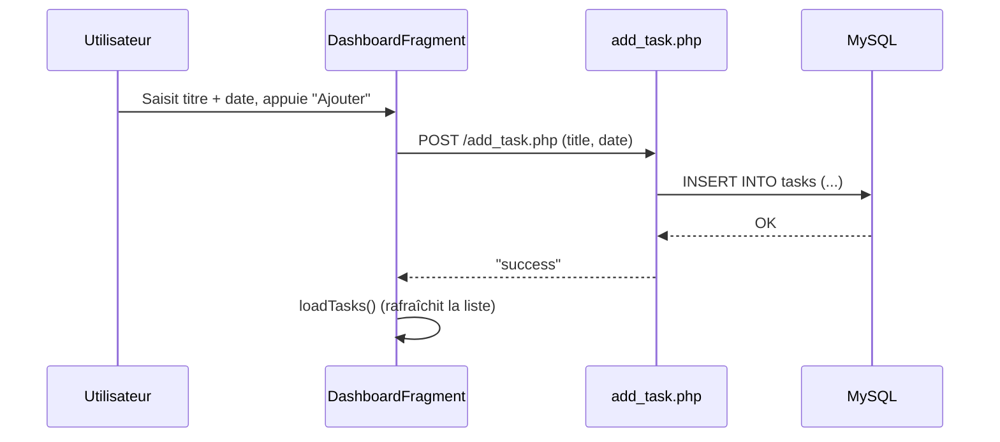

# 📝 ToDoList — Application Full Stack (Android + REST API)

Application de gestion de tâches composée d'un **client Android natif** (Java) et d'une **API REST PHP / MySQL**. Le projet illustre une architecture client-serveur simple : l'application mobile consomme une API HTTP qui persiste les données dans une base MySQL.


---

## 📌 Sommaire

- [Aperçu](#-aperçu)
- [Captures d'écran](#-captures-décran)
- [Architecture](#-architecture)
- [Stack technique](#-stack-technique)
- [Structure du projet](#-structure-du-projet)
- [Base de données](#-base-de-données)
- [Endpoints API](#-endpoints-api)
- [Installation](#-installation)
- [Roadmap / Améliorations](#-roadmap--améliorations)
- [Auteur](#-auteur)

---

## 🚀 Aperçu

**ToDoList** permet à un utilisateur de :
- Créer un compte et se connecter (`register` / `login`)
- Ajouter, modifier et supprimer des tâches avec une date associée
- Cocher une tâche comme terminée
- Consulter, dans un onglet dédié, les tâches prévues **pour aujourd'hui** (notifications)

L'application suit l'architecture standard Android **Activity → Fragments (Bottom Navigation)**, avec **Retrofit** pour la communication réseau vers l'API PHP.

---

## 📸 Captures d'écran

<table align="center">
  <tr>
    <td align="center">
      <br/>
      <sub><b>Inscription</b></sub>
    </td>
    <td align="center">
      <br/>
      <sub><b>Connexion</b></sub>
    </td>
    <td align="center">
      <br/>
      <sub><b>Accueil</b></sub>
    </td>
  </tr>
  <tr>
    <td align="center">
      <br/>
      <sub><b>Ajout de tâche</b></sub>
    </td>
    <td align="center">
      <br/>
      <sub><b>Liste des tâches</b></sub>
    </td>
    <td align="center">
      <br/>
      <sub><b>Notifications du jour</b></sub>
    </td>
  </tr>
</table>
---

## 🏗 Architecture



### Flux d'ajout de tâche



---

## 🛠 Stack technique

**Mobile**
- Java, Android SDK (minSdk 24, targetSdk 35)
- Architecture Fragments + Bottom Navigation
- [Retrofit 2](https://square.github.io/retrofit/) + Gson (appels API)
- OkHttp Logging Interceptor
- ViewBinding

**Backend**
- PHP (procédural, `mysqli`)
- MySQL / MariaDB (via XAMPP)
- API REST simple (réponses `JSON` / texte `success` / `error`)

---

## 📂 Structure du projet

```
ToDoList-FullStack/
├── backend/                  # API REST PHP (todolistapi)
│   ├── db.php                 # Connexion MySQL
│   ├── register.php           # Inscription utilisateur
│   ├── login.php              # Connexion utilisateur
│   ├── add_task.php           # Ajouter une tâche
│   ├── get_tasks.php          # Récupérer toutes les tâches (JSON)
│   ├── update_task.php        # Modifier une tâche
│   ├── delete_task.php        # Supprimer une tâche
│   └── toggle_task.php        # Basculer l'état "terminé"
│
├── mobile/                   # Application Android (ToDoListProjet)
│   └── app/src/main/java/my/app/todolistprojet/
│       ├── LoginActivity.java
│       ├── RegisterActivity.java
│       ├── MainActivity.java
│       ├── ApiService.java        # Interface Retrofit
│       ├── RetrofitClient.java    # Config Retrofit (base URL)
│       ├── Task.java              # Modèle de données
│       ├── TaskAdapter.java       # Adapter ListView
│       └── ui/
│           ├── dashboard/         # Ajout / liste des tâches
│           ├── home/
│           └── notifications/     # Tâches du jour
│
├── database/
│   └── todolist.sql          # Script de création de la base
│
├── screenshots/               # Captures d'écran pour ce README
└── README.md
```

---

## 🗄 Base de données

Deux tables principales (voir [`database/todolist.sql`](database/todolist.sql)) :

**`users`**

| Colonne | Type | Détails |
|---|---|---|
| id | INT | PK, AUTO_INCREMENT |
| username | VARCHAR(255) | |
| email | VARCHAR(255) | UNIQUE |
| password | VARCHAR(255) | |

**`tasks`**

| Colonne | Type | Détails |
|---|---|---|
| id | INT | PK, AUTO_INCREMENT |
| title | VARCHAR(255) | |
| date_task | DATE | format `yyyy-MM-dd` |
| completed | TINYINT(1) | défaut `0` |

---

## 🔌 Endpoints API

| Méthode | Endpoint | Paramètres | Description |
|---|---|---|---|
| POST | `/register.php` | `username`, `email`, `password` | Créer un compte |
| POST | `/login.php` | `email`, `password` | Authentifier un utilisateur |
| GET | `/get_tasks.php` | — | Lister toutes les tâches (JSON) |
| POST | `/add_task.php` | `title`, `date` | Ajouter une tâche |
| POST | `/update_task.php` | `id`, `title`, `date` | Modifier une tâche |
| POST | `/delete_task.php` | `id` | Supprimer une tâche |
| POST | `/toggle_task.php` | `id`, `completed` | Marquer terminée / non terminée |

---

## ⚙️ Installation

### 1. Backend (API PHP)

```bash
# Copier le dossier backend/ dans htdocs de XAMPP
cp -r backend/ C:/xampp/htdocs/todolistapi

# Démarrer Apache et MySQL depuis le panneau XAMPP

# Importer la base de données
# phpMyAdmin > Créer une base "todolist" > Importer > database/todolist.sql
```

L'API est alors accessible sur `http://localhost/todolistapi/`.

### 2. Application mobile (Android)

```bash
# Ouvrir le dossier mobile/ dans Android Studio
```

Vérifie l'URL de base dans `RetrofitClient.java` :

```java
private static final String BASE_URL = "http://10.0.2.2/todolistapi/";
```

> `10.0.2.2` correspond à `localhost` de ta machine, vu depuis l'émulateur Android. Si tu testes sur un téléphone physique, remplace par l'adresse IP locale de ton PC (ex: `http://192.168.1.X/todolistapi/`).

Lance l'app depuis Android Studio (Run ▶️).

---

## 🧭 Roadmap / Améliorations

- [ ] Sécuriser les requêtes SQL avec des requêtes préparées (protection contre les injections SQL)
- [ ] Hacher les mots de passe (`password_hash` / `password_verify`) au lieu de les stocker en clair
- [ ] Lier les tâches à l'utilisateur connecté (ajout d'une colonne `user_id`)
- [ ] Ajouter un système de token/session pour l'authentification
- [ ] Notifications push locales (rappel des tâches du jour)
- [ ] Tests unitaires et instrumentés sur l'app Android

---

## 👤 Auteur

Développé par **[Ons Ajmi]** — projet réalisé dans le cadre de l'apprentissage du développement mobile Android et des API REST.

<p align="center">
  <strong>Ons Ajmi</strong> — étudiante en 1ère année Cycle Ingénieur, TEK-UP University<br>
  GitHub : <a href="https://github.com/AjmiOns">AjmiOns (Ons Ajmi)</a> · LinkedIn : <a href="https://www.linkedin.com/in/ons-ajmi-0ab2982a2/">Ons Ajmi</a>
</p>